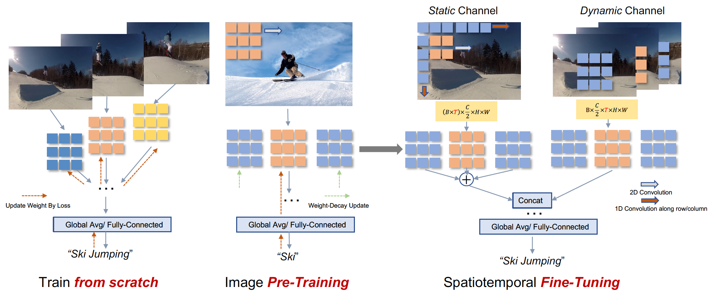

# In Defense of Image Pre-Training for Spatiotemporal Recognition   [[arXiv]]()


**[NEW!]**  2022/5/5 - We have released the code and models.

## Overview


This is a PyTorch/GPU implementation of the paper  [In Defense of Image Pre-Training for Spatiotemporal Recognition]().


<div  align="center">    
    
    <br>
    <div style="color:orange; border-bottom: 2px solid #d9d9d9;
    display: inline-block;
    color: #999;
    padding: 10px;">
      The overall Overview of Image Pre-Training & Spatiotemporal Fine-Tuning..
  	</div>
</div>

* The Image Pre-Training code is located in [Image_Pre_Training](Image_Pre_Training), which is based on the [timm repo](https://github.com/rwightman/pytorch-image-models).

* The [Spatiotemporal Finetuning](Spatiotemporal_Finetuning) code is a modification on the [mmaction2](https://github.com/open-mmlab/mmaction2). Installation and preparation follow that repo.

* You can find the proposed STS 3D convolution in [STS_Conv](Spatiotemporal_Finetuning/mmaction/models/backbones/STS_Conv.py).


## Content


- [Prerequisites](#prerequisites)

- [Video Dataset Preparation]()

- [Model ZOO]()

- [Usage](#usage)


## Prerequisites


The code is built with following libraries:


- python 3.8.5 or higher

- [PyTorch](https://pytorch.org/) 1.10.0+cu113

- [torchvision](https://github.com/pytorch/vision) 0.11.1+cu113

- [opencv-python](https://pypi.org/project/opencv-python/) 4.4.0

- [mmcv](https://github.com/open-mmlab/mmcv) 1.4.6

- [mmaction](https://github.com/open-mmlab/mmaction2) 0.20.0+

- [decord](https://github.com/dmlc/decord)


## Video Dataset Preparation

We mainly focus on two widely-used video classification benchmarks [Kinetics-400](https://github.com/open-mmlab/mmaction2/blob/master/tools/data/kinetics/README.md)  and [Something-Something V2](https://github.com/open-mmlab/mmaction2/blob/master/tools/data/sthv2/README.md).

Some notes before preparing the two datasets:

1. We decode the video online to reduce the cost of storage. In our experiments, the cpu bottleneck issue only appears when input frames are more than 8.

2. The frame resolution of Kinetics-400 we used is with a short-side 320. The number of train / validation data for our experiments is 240436 /19796. We also provide the [train/val list]().  


We provide our annotation and data structure bellow for easy installation.


- Generate the annotation.
  
  The annotation usually includes train.txt, val.txt. The format of *.txt file is like:

  ```
  video_1 label_1
  video_2 label_2
  video_3 label_3
  ...
  video_N label_N
  ```

  The pre-processed dataset is organized with the following structure:

  ```
  datasets
    |_ Kinetics400
      |_ videos
      |  |_ video_0
      |  |_ video_1
         |_ ...  
         |_ video_N 
      |_ train.txt
      |_ val.txt
  ```


## Model ZOO 

Here we provide video dataset list and pretrained weights in this [OneDrive]() or [GoogleDrive](). 

## ImageNet-1k

We provide ImageNet-1k pre-trained weights for five video models. All models are trained for 300 epochs. Please follow the scripts we provided to evaluate or finetune on video dataset.

|                                   Models/Configs                                    | Resolution | Top-1 |    Checkpoints     |
|:-----------------------------------------------------------------------------------:|:----------:|-------|:------------------:|
|                     [ir-CSN50](Image_Pre_Training/scripts/csn)                      | 224 * 224  | 78.8% |      [ckpt]()      |
|                  [R2plu1d34](Image_Pre_Training/scripts/r2plus1d)                   | 224 * 224  | 79.6% |      [ckpt]()      |
|               [SlowFast50-4x16](Image_Pre_Training/scripts/slowfast)                | 224 * 224  | 79.9% |      [ckpt]()      |
|                [SlowFast50-8x8](Image_Pre_Training/scripts/slowfast)                | 224 * 224  | 79.1% |      [ckpt]()      |
|                  [Slowonly50](Image_Pre_Training/scripts/slowonly)                  | 224 * 224  | 79.9% |      [ckpt]()      |
|                       [X3D-S](Image_Pre_Training/scripts/x3d)                       | 224 * 224  | 74.8% |      [ckpt]()      |


## Kinetics-400

Here we provided the 50-epoch fine-tuning configs and checkpoints. We also include some 100-epochs checkpoints for a better performance but with a comparable computation.  

|                                                  Models/Configs                                                  | Resolution | Frames * Crops * Clips | 50-epoch Top-1 | 100-epoch Top1       | Checkpoints folder |
|:----------------------------------------------------------------------------------------------------------------:|:----------:|:----------------------:|----------------|----------------------|--------------------|
|           [ir-CSN50](Spatiotemporal_Finetuning/configs/recognition/csn/ircsn50_32x2_STS_k400_video.py)           | 256 * 256  |      32 * 3 * 10       | 76.8%          | 76.7%                | [ckpt]()           |
|      [R2plu1d34](Spatiotemporal_Finetuning/configs/recognition/r2plus1d/r2plus1d_r34_8x8_STS_k400_video.py)      | 256 * 256  |       8 * 3 * 10       | 76.2%          | Over training budget | [ckpt]()           |
| [SlowFast50-4x16](Spatiotemporal_Finetuning/configs/recognition/slowfast/slowfast50_4x16_32x2_STS_k400_video.py) | 256 * 256  |      32 * 3 * 10       | 76.2%          |                      | [ckpt]()           |
|  [SlowFast50-8x8](Spatiotemporal_Finetuning/configs/recognition/slowfast/slowfast50_8x8_32x2_STS_k400_video.py)  | 256 * 256  |      32 * 3 * 10       | 77.2%          | 77.9%                | [ckpt]()           |
|      [Slowonly50](Spatiotemporal_Finetuning/configs/recognition/slowonly/slowonly50_8x8_STS_k400_video.py)       | 256 * 256  |       8 * 3 * 10       | 75.7%          | Over training budget | [ckpt]()           |
|             [X3D-S](Spatiotemporal_Finetuning/configs/recognition/x3d/x3d_s_13x6_STS_k400_video.py)              | 192 * 192  |      13 * 3 * 10       | 72.5%          |                      | [ckpt]()           |


## Something-Something V2


|                                                                                       Models/Configs                                                                                       | Resolution | Frames * Crops * Clips | Top-1 | Checkpoints |
|:------------------------------------------------------------------------------------------------------------------------------------------------------------------------------------------:|:----------:|:----------------------:|-------|-------------|
|                                                [ir-CSN50](Spatiotemporal_Finetuning/configs/recognition/csn/ircsn50_1x8_STS_sthv2_video.py)                                                | 256 * 256  |       8 * 3 * 1        | 61.4% |    [ckpt]() |
|                                          [R2plu1d34](Spatiotemporal_Finetuning/configs/recognition/r2plus1d/r2plus1d_r34_1x8_STS_sthv2_video.py)                                           | 256 * 256  |       8 * 3 * 1        | 63.0% |    [ckpt]() |
|                                     [SlowFast50-4x16](Spatiotemporal_Finetuning/configs/recognition/slowfast/slowfast50_4x16_1x32_STS_sthv2_video.py)                                      | 256 * 256  |       32 * 3 * 1       | 57.2% |    [ckpt]() | 
|                                           [Slowonly50](Spatiotemporal_Finetuning/configs/recognition/slowonly/slowonly50_1x8_STS_sthv2_video.py)                                           | 224 * 224  |       8 * 3 * 1        | 62.7% |    [ckpt]() |
|                                                  [X3D-S](Spatiotemporal_Finetuning/configs/recognition/x3d/x3d_s_1x8_STS_sthv2_video.py)                                                   | 224 * 224  |       8 * 3 * 1        | 58.3% |    [ckpt]() |


After downloading the checkpoints and putting them into the target path, you can fine-tune or test the models with corresponding [configs](Spatiotemporal_Finetuning/configs) following the instruction bellow.


## Usage

## Build 
After having the above dependencies, run:
```shell
git clone https://github.com/UCSC-VLAA/Image-Pretraining-for-Video
cd Image_Pre_Training # first pretrain the 3D model on ImageNet
cd Spatiotemporal_Finetuning # then finetune the model on target video dataset
```


## Pre-Training

We have provided some widely-used 3D model pre-trained weights that you can directly use for evaluation or fine-tuning.

After downloading the pre-training weights, for example, you can evaluate the CSN model on Imagenet by running: 

```shell
bash scripts/csn/distributed_eval.sh [number of gpus]
```


The pre-training scripts for listed models are located in [scripts](Image_Pre_Training/scripts). Before training the model on ImageNet, you should indicate some paths you would like to store the checkpoint `your data path` and `--output`. By default, we use [wandb](https://docs.wandb.ai/quickstart) to show the curve.

For example, pre-train a CSN model on Imagenet: 

```shell
bash scripts/csn/distributed_train.sh [number of gpus]
```


## Fine-tuning

After pre-training,  you can use the following command to fine-tune a video model.

Some Notes:

* In the config file, change the `load_from = [your pre-trained model path]`.

* Simply setting the `reshape_t` or `reshape_st` in the model config to False can disable the STS Conv. 

Then you can use the following command to fine-tune the models.

```shell
bash tools/dist_train.sh ${CONFIG_FILE} [optional arguments]
```

Example: train a CSN model on Kinetics-400 dataset with periodic validation.

```shell
bash tools/dist_train.sh configs/recognition/csn/ircsn50_32x2_STS_k400_video.py [number of gpus] --validate 
```


## Testing

You can use the following command to test a model.

```shell
bash tools/dist_test.sh ${CONFIG_FILE} ${CHECKPOINT_FILE} [optional arguments]
```

Example: test a CSN model on Kinetics-400 dataset and dump the result to a json file.

```shell
bash tools/dist_test.sh configs/recognition/csn/ircsn50_32x2_STS_k400_video.py \
    checkpoints/SOME_CHECKPOINT.pth [number of gpus] --eval top_k_accuracy mean_class_accuracy \
    --out result.json --average-clips prob 
```


## Acknowledgment

This repo is based on [timm](https://github.com/rwightman/pytorch-image-models) and [mmaction2](https://github.com/open-mmlab/mmaction2).
Thanks the contributors of these repos!


## Citation

```
citation
```
